Neural Networks: A Review of Machine and Deep Learning Classifiers for the Prediction of Parkinson Disease 
========================================================
author: Jack Russo
date: 10/25/2020
autosize: true

Introduction - Motivating the Problem (1/2)
========================================================

According to: Active aging for individuals with Parkinson's disease: definitions, literature review,
and models.

“Parkinson's disease (PD) is a progressive neurodegenerative disorder that affects 1% of all people
over 60 years of age in industrialized countries and is considered as the second most prevalent
geriatric neurodegenerative disorder after Alzheimer's disease.”


Introduction - Motivating the Problem (2/3) 
========================================================

The review further states,

“Point prevalence of dementia has been estimated as 40% in (the) PD population, the condition
which lately affects more than 75% of individuals with PD after 8 years and more than 80%
following 20 years of suffering from PD. Even in (the) nondemented PD elderly, a less severe
condition, mild cognitive impairment, is common… Early detection and proper management of
cognitive impairment are crucial in individuals with PD in order to enhance their mental wellbeing.”

Introduction - Motivating the Problem (3/3) 
========================================================

While the focus of this project was not Parkinson's disease itself per se, the proceeding statements served as the guiding motivation. 

- Effectively diagnosing patients with PD as early as possible permits medical professionals and patients to take preventative action while the disease is in its early stage.
- However the COVID-19 pandemic has added a new layer of complexity in doing so. As the PD population correlates with those most at risk of a serious infection, diagnosis of PD in a centralized medical facility places an undue burden on those seeking an evaluation. 

Enter A.I. - Remote Diagnosis
========================================================

In 2018 the authors of 

"Comparative Analysis of the Classification Performance of Machine Learning Classifiers and Deep Neural Network Classifier for Prediction of Parkinson Disease."

Evaluated the performance of four machine learning protocols in diagnosing Parkinson's Disease via features of voice recordings from the open-source UCI Parkinson dataset.

<https://archive.ics.uci.edu/ml/datasets/Parkinsons>

A strong showing by any of these ML methods on this data would enable remote diagnosis of PD, and thus eliminate the need for patients to be evaluated in person.

The Data (1/2)
========================================================

The measured voice features were

- ASCII subject name and recording number
- MDVP:Fo(Hz) Average vocal fundamental frequency
- MDVP:Fhi(Hz) Maximum vocal fundamental frequency
- MDVP:Flo(Hz) Minimum vocal fundamental frequency
- Several measures of variation in fundamental frequency
- Several measures of variation in amplitude
- NHR,HNR - Two measures of ratio of noise to tonal components in the voice
- status - Health status of the subject (one) - Parkinson's, (zero) - healthy
- RPDE,D2 - Two nonlinear dynamical complexity measures
- DFA - Signal fractal scaling exponent
- spread1, spread2, PPE - Three nonlinear measures of fundamental frequency variation

The Data (2/2)
========================================================

- The observations, 197 in all were drawn from 31 people, 23 of whom had PD.
- Thus the set as a whole is not independent.
- The authors used all numeric features when computing the diagnosis of each observation.
- 70% / 30% Train Test Split.

The Not So Crystal Clear ML Methods 
========================================================

The algorithms evaluated were:

- Logistic Regression

- Support Vector Machines 

- K Nearest Neighbor

- Deep Neural Networks 

Logistic Regression
========================================================

As the title suggests, logistic regression takes the log odds:

1/(1 + e^(lm))

that an observation has PD. Where the lm is the sum of a multiple linear regression. 


- The authors set the parameter 'C', the inverse constant scalar for all observations at ten.
- If the probability is greater than .5 then that observation is flagged as having PD.
Support Vector Machines
========================================================

SVM computes the value of e^-y(bi-a)^2 between an observation 'a' who's class is unknown and all known observations 'bi' for a given variable. In the case of two classes, the unknown observation is predicted from the class of the the largest kernal value.

- Like Logistic regression, the authors set the parameter 'C', the inverse constant scalar for all observations at ten.

- The authors set the parameter 'y', the inverse exponential constant scalar for all observations at .025.

K Nearest Neighbor 
========================================================

KNN computes the Euclidean distance r = (dx1^2 + dx2^2 + dx3^2 ...)^.05 between an observation 'a' who's class is unknown and all known observations 'bi' for all given variables. In the case of two classes, the unknown observation is predicted from the k nearest neighbors/smallest r values. The majority class of those 'k' neighbors becomes the predicted class of the new observation.

- The authors left 'k', the number of nearest neighbors at the default value of 5.

Multi-layer Perceptron (Deep Neural Network) (1/2)
========================================================

MLP treats each row of data as a vector and applies a series of matrix multiplications on that vector to arrive at a two dimensional vector with binary entries [1,0] or [0,1]. All intermediate negative sums are rounded to zero ('ReLu' activation) to speed up this computation. During training the difference between the output vector and true vector squared is minimized by tuning each matrix entry, in particular the ones that have the greatest influence on the output vector.

Multi-layer Perceptron (Deep Neural Network) (2/2)
========================================================

- The authors specified two 'layers' of length 22 and 2 respectively, where the first layer is double the number of variables and the last layer is the shape of the desired output vector.
- Each 'layer' can be thought of as a non-square matrix with a number of rows equal to it's specified length and columns equal to the dimensions of the proceeding transformed vector.

Performance Classification Metrics (1/2)
========================================================


```
                   PD Healthy
Predicted PD       TP      FP
Predicted Healthly FN      TN
```

Performance Classification Metrics (2/2)
========================================================


```
      Metric     Equation
 Sensitivity TP/(TP + FN)
 Specificity TN/(TN + FP)
    Accuracy % Total True
```

Stated Results
========================================================

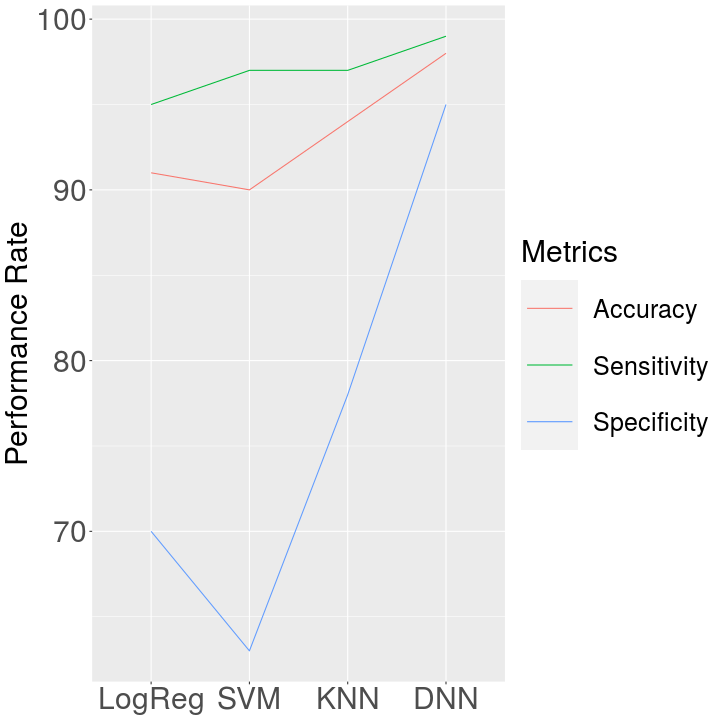

Peer Review
========================================================
Given that the preceding comparative analysis was not peer reviewed, I sought to answer three questions.

1. Were these results reproducible?
2. Were these results generalizable to other PD data?
3. If the answers to the proceeding questions were yes, did the gains from implementing a Deep
Neural Network warrant the additional costs of time and computation?

Additional Conditions (1/4)
========================================================

Given that PD only has a one percent occurrence rate in industrialized countries, the precision rate of any ML method needs to be comparable to the other metrics. 

The precision rate is defined as;


```
    Metric     Equation
 Precision TP/(TP + FP)
```

Additional Conditions (2/4)
========================================================

Given that the data used in the original analysis was not independent,
for the reported results to be general we need to see comparable performance on independent voice recordings of patients. 

- Original data:
  <https://archive.ics.uci.edu/ml/datasets/Parkinsons> 

- Control data: <https://archive.ics.uci.edu/ml/datasets/Parkinson+Dataset+with+replicated+acoustic+features+>   

Additional Conditions (3/4)
========================================================

To evaluate the computational cost of each method, the system.time() of each training phase for each method was averaged over ten training iterations.

For example;


```r
# Not Run

# train_time_logReg <- mean(c(
#   system.time(skl_Logistic_Regression(data_X_y = source('/cloud/project/data_X_y.R')$value, C = 10)),
#   system.time(skl_Logistic_Regression(data_X_y = source('/cloud/project/data_X_y.R')$value, C = 10)),
# ...
# ))
```

Additional Conditions (4/4)
========================================================

No feature selection.

While it is true you can boost overall accuracy of a model by pruning the predictive variables, one of the main advantages of implementing a DNN is the built in feature selection. Thus all models were fitted on all available training data to evaluate their overall feature selection performance.

Scikit Learn and Reticulate (1/2)
========================================================

To make a fair one to one comparison between methods, I translated all four algorithms from SciKit-Learn: <https://scikit-learn.org/stable/modules/classes.html#module-sklearn.neighbors>

using the Reticulate R package: <https://rstudio.github.io/reticulate/>

Scikit Learn and Reticulate (2/2)
========================================================
For example once SciKit-Learn is installed in the "r-reticulate" enviroment via Reticulate, you can call KNN via a help function in R:

```r
# load env
require(reticulate)
use_virtualenv(virtualenv = "r-reticulate")

# Declare In House KNN Function

skl_KNN <- function(data_X_y = import("sklearn.datasets")$load_iris(return_X_y = T),
                    n_neighbors=5,
                    weight='uniform',
                    algorithm='auto',
                    leaf_size=30,
                    p=2,
                    metric='minkowski',
                    metric_params= NULL, 
                    n_jobs= NULL){
  sk.neighbors <- import("sklearn.neighbors")
  sk.neighbors.knn <- sk.neighbors$KNeighborsClassifier()
  # Override Default  
  sk.neighbors.knn$n_neighbors <- as.integer(n_neighbors)
  sk.neighbors.knn$weights <- weight
  sk.neighbors.knn$algorithm <- algorithm
  sk.neighbors.knn$leaf_size <- leaf_size
  sk.neighbors.knn$metric <- metric
  sk.neighbors.knn$metric_params <- metric_params
  sk.neighbors.knn$n_jobs <- NULL
  model <- sk.neighbors.knn$fit(X = data_X_y[[1]], y = import("numpy")$ravel(data_X_y[[2]]))
  return(model)
}
```


Reproduction on Original Data - Raw Metrics (1/4)
========================================================


Reproduction on Original Data - Raw Metrics (2/4)
========================================================

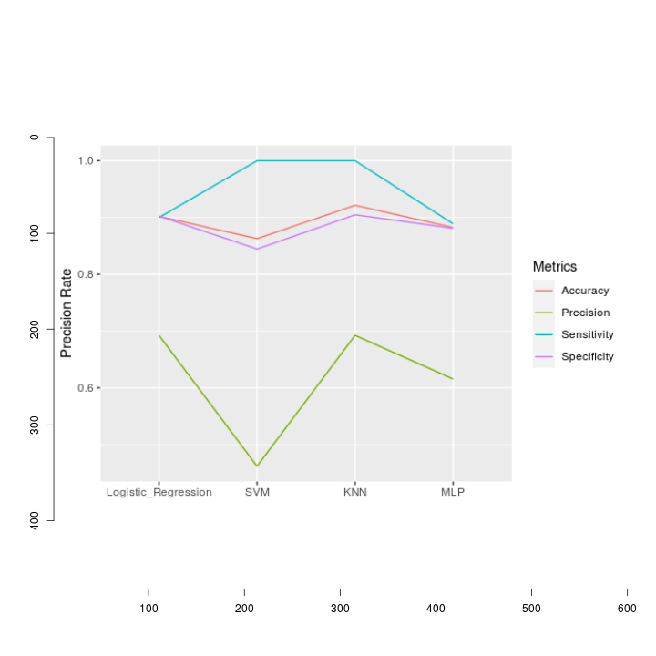

Reproduction on Original Data - Raw Metrics (3/4)
========================================================

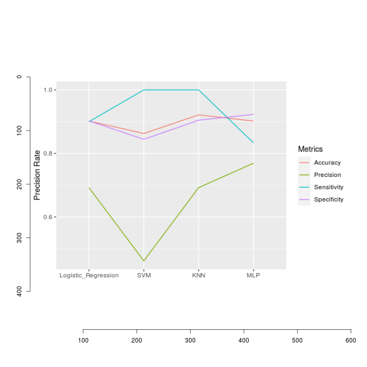

Reproduction on Original Data - Raw Metrics (4/4)
========================================================

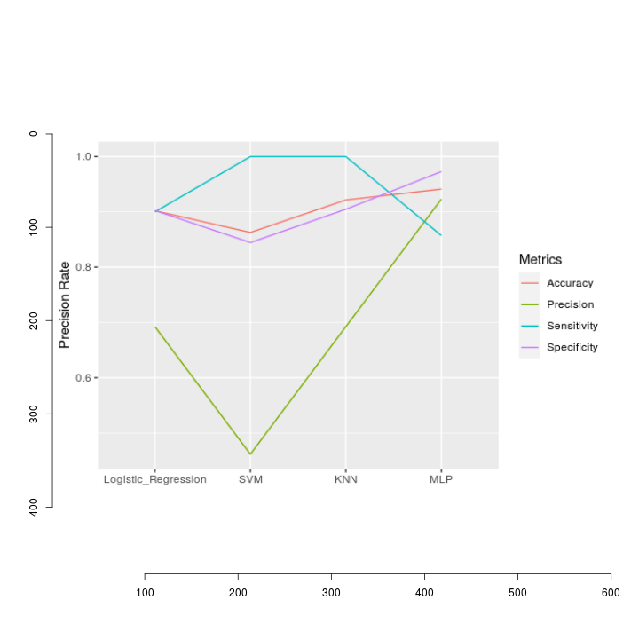

Reproduction on Original Data - Scaled via system.time()
========================================================

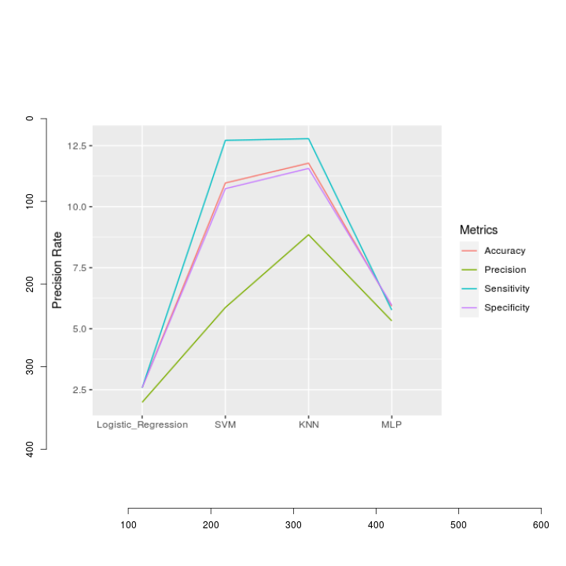

Test Data - Partition 1
========================================================

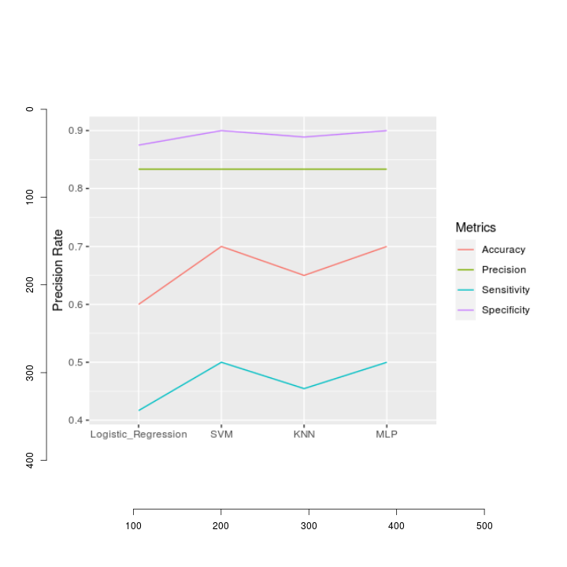

Test Data - Partition 1 / system.time()
========================================================

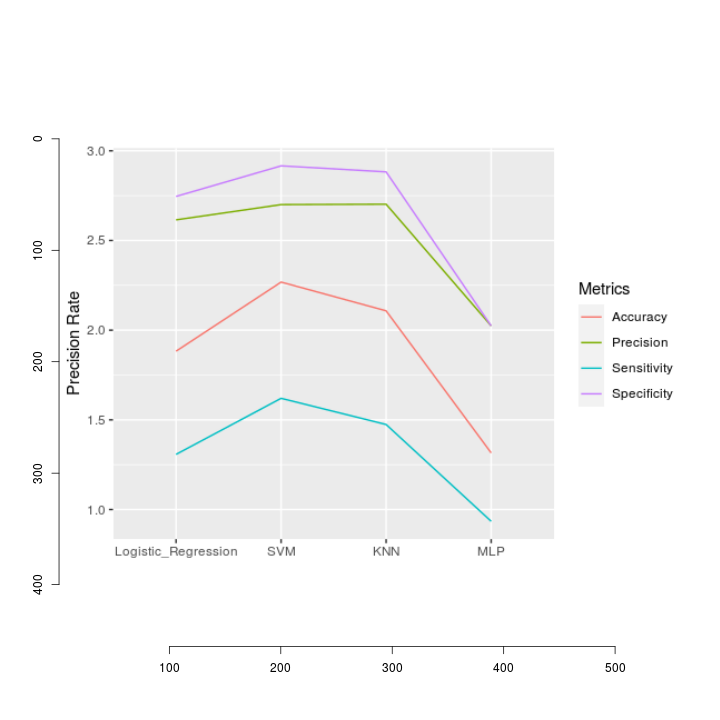

Test Data - Partition 2
========================================================

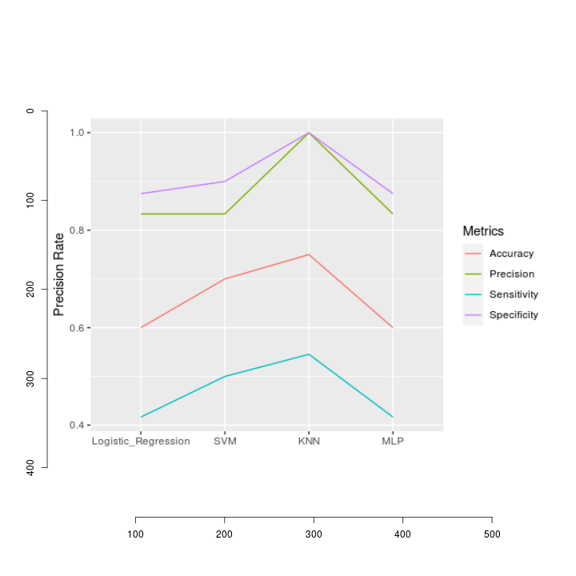

Test Data - Partition 2 / system.time()
========================================================

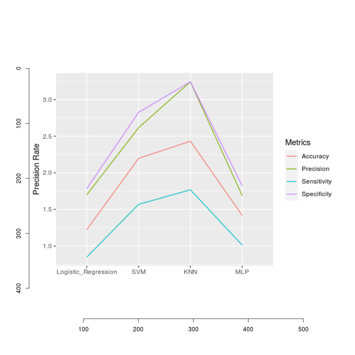

Test Data - Partition 3
========================================================

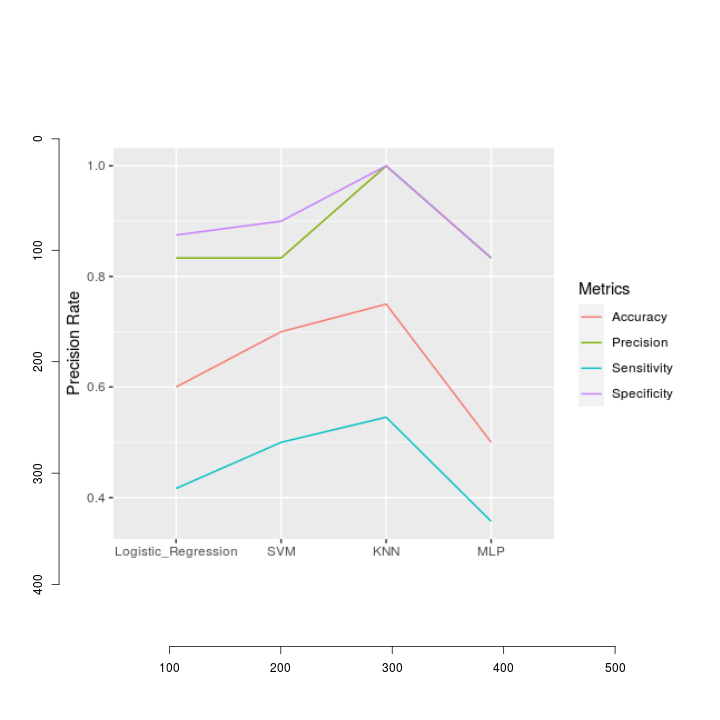

Test Data - Partition 3 / system.time()
========================================================

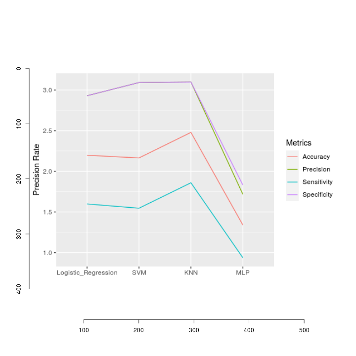

Conclusions (1/2)
========================================================

While the results of the original comparative analysis were reproducible is a sense, the case for a MLP was not as clear cut as the authors presented.
- The large variations in performance of the MLP were likely the result of stochastic gradient descent. Training a MLP on the same training data does not guarantee the same performance each time because their can be multiple minima within the space of possible parameters.
- When each method's performance was evaluated on the independent trials, a clear case emerged for K-Nearest Neighbor. In two of the three independent batches KKN outperformed the other methods on all metrics. This case became even more pronounced when each metric was scaled via the mean training time for each method.

Conclusions (2/2)
========================================================
- While additional independent observations, fine-tuning, and network architecture could overturn these conclusions, researchers working with limited resources appear to be best served by implementing a KNN method in remote PD diagnosis.

Source Code 
========================================================

All source code used in this project can be located on my GitHub:
<https://github.com/Iota-Rho-Stack?tab=repositories>

Bibliography (1/4)
========================================================

- A. Ul Haq et al ., "Comparative Analysis of the Classification Performance of Machine
Learning Classifiers and Deep Neural Network Classifier for Prediction of Parkinson
 Disease," 2018 15th International Computer Conference on Wavelet Active Media
 Technology and Information Processing (ICCWAMTIP) , Chengdu, China, 2018, pp. 101-106,
doi: 10.1109/ICCWAMTIP.2018.8632613.

- Fereshtehnejad, S.-M., & Lokk, J. (2014). Active aging for individuals with Parkinson's
 disease: definitions, literature review, and models. Parkinson's Disease.
 
- 'Exploiting Nonlinear Recurrence and Fractal Scaling Properties for Voice Disorder
  Detection', Little MA, McSharry PE, Roberts SJ, Costello DAE, Moroz IM. BioMedical
  Engineering OnLine 2007, 6:23 (26 June 2007)

Bibliography (2/4)
========================================================

- Naranjo, L., Pérez, C.J., Campos-Roca, Y., MartÃn, J.: Addressing voice recording
replications for Parkinson’s disease detection. Expert Systems With Applications 46,
286-292 (2016)

- Seyed-Mohammad Fereshtehnejad, and Johan Lökk. “Active Aging for Individuals with
Parkinson’s Disease: Definitions, Literature Review, and Models.” Parkinson’s disease
2014.2014 (2014): 739718–8. Web.

- Scikit-learn: Machine Learning in Python, Pedregosa et al., JMLR 12, pp. 2825-2830, 2011.

Bibliography (3/4)
========================================================

- Wang, Y., Christley, S., Mjolsness, E., & Xie, X. (2010). Parameter inference for discretely
 observed stochastic kinetic models using stochastic gradient descent. BMC Systems
 Biology , 4 , 99.

- Qian, Qi et al. “Efficient Distance Metric Learning by Adaptive Sampling and Mini-Batch
 Stochastic Gradient Descent (SGD).” Machine learning 99.3 (2015): 353–372. Web.
 
Bibliography (4/4)
========================================================
 
- Lianfang Cai et al. “Real-Time Detection of Power System Disturbances Based on k -
 Nearest Neighbor Analysis.” IEEE Access 5 (2017): 5631–5639. Web.
 
-  Horvath, D., Marcou, G., Varnek, A., Kayastha, S., de la Vega de León, A., & Bajorath, J.
(2016). Prediction of Activity Cliffs Using Condensed Graphs of Reaction Representations,
Descriptor Recombination, Support Vector Machine Classification, and Support Vector
Regression. Journal of Chemical Information and Modeling, 56(9), 1631–1640.


Fin
========================================================
